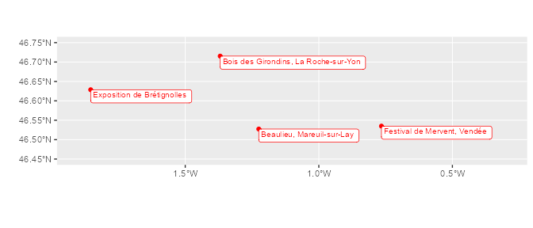

-   <a href="#heuristr" id="toc-heuristr">heuristr</a>
-   <a href="#installation" id="toc-installation">Installation</a>
-   <a href="#before-using-heuristr-export-xml-files-from-heurist"
    id="toc-before-using-heuristr-export-xml-files-from-heurist">Before
    using heuristr : export XML files from Heurist</a>
-   <a href="#example-database-and-data-files"
    id="toc-example-database-and-data-files">Example database and data
    files</a>
-   <a
    href="#read-data-and-paradata-from-heurist-database-with-hr_import-function"
    id="toc-read-data-and-paradata-from-heurist-database-with-hr_import-function">Read
    data and paradata from Heurist database, with <em>hr_import()</em>
    function</a>
    -   <a href="#about-columns-names-and-formats"
        id="toc-about-columns-names-and-formats">About columns names and
        formats</a>
    -   <a
        href="#dealing-with-repeatable-fields-multiple-values-in-a-field-for-one-record"
        id="toc-dealing-with-repeatable-fields-multiple-values-in-a-field-for-one-record">Dealing
        with “repeatable” fields (multiple values in a field for one record)</a>
    -   <a href="#gathering-terms-in-a-vocabulary"
        id="toc-gathering-terms-in-a-vocabulary">Gathering terms in a
        vocabulary</a>
    -   <a href="#dealing-with-record-relationship"
        id="toc-dealing-with-record-relationship">Dealing with “Record
        relationship”</a>
        -   <a href="#relationship-marker-fields"
            id="toc-relationship-marker-fields">“Relationship marker” fields</a>
        -   <a href="#relation-vocabularies"
            id="toc-relation-vocabularies">“Relation” vocabularies</a>
        -   <a href="#record-relationship-dataframe"
            id="toc-record-relationship-dataframe">“Record relationship”
            dataframe</a>
    -   <a href="#dealing-with-temporal-spatial-and-file-fields"
        id="toc-dealing-with-temporal-spatial-and-file-fields">Dealing with
        <em>temporal</em>, <em>spatial</em> and <em>file</em> fields</a>
        -   <a href="#temporal-fields" id="toc-temporal-fields"><em>Temporal</em>
            fields</a>
        -   <a href="#spatial-fields" id="toc-spatial-fields"><em>Spatial</em>
            fields</a>
        -   <a href="#file-fields" id="toc-file-fields"><em>File</em> fields</a>
-   <a href="#saving-data-into-a-r-data-file"
    id="toc-saving-data-into-a-r-data-file">Saving data into a R data
    file</a>

# heuristr

*heuristr* aims to make easier quantitative analysis from [Heurist
databases](https://heuristnetwork.org/).

# Installation

You can install the development version of heuristr from GitHub with:

    # install.packages("devtools")
    devtools::install_github("alietteroux/heuristr")

 

# Before using heuristr : export XML files from Heurist

*hr\_import()* reads XML files exported from Heurist. To use it, **two
XML files must be first exported from Heurist** :

-   a XML file including data (fields’values entered in the database) :
    this XML file can be exported from Heurist via the Publish menu &gt;
    Export &gt; XML (recommended option). Be careful : if some records
    are selected in your Heurist session during the export, only data
    about theses selected records will be exported.
-   a XML file exported from Heurist describing database structure
    (vocabularies, fields’caracteristics…) : this XML file can be
    exported from Heurist via the Design menu &gt; Download &gt;
    Structure (XML).

 

# Example database and data files

We’ve created a fictitious Heurist database, named “aliet\_test\_R”,
viewable at
<https://heurist.huma-num.fr/heurist/?db=aliet_test_R&website>

From this database, we’ve exported two XML files : have a look to the
folder “documents/data\_example” of the [Github
repository](https://github.com/alietteroux/heuristr), or directly
download these files
[here](https://uncloud.univ-nantes.fr/index.php/s/QrgE4zeJfgP4R4Q).

 

# Read data and paradata from Heurist database, with *hr\_import()* function

    library(heuristr)

    hr_import(data.file="documents/data_example/aliet_test_R_data.xml",
              structure.file="documents/data_example/aliet_test_R_structure.xml")
    #> We're importing data and structure files (most time-consuming step)... Thank you for waiting...
    #> Data and structure files have been successfully imported. Now we're selecting and managing data... Thank you for waiting...
    #> We've finished. It's ready to use !
    #> Import has required 7.88 secs

This function returns several dataframes in the Environment :

-   Each Heurist *‘record type’* as a dataframe : in those dataframes,
    each row matches a Heurist *‘record’*
-   A dataframe named “**z.h.tables.fields**” : each row describes a
    field in an used Heurist *‘record type’* (type, help text,
    requirement, repeatability…)
-   A dataframe named “**z.h.vocabularies**” : each row matches a term
    in an used Heurist vocabulary ; each term is joined to a level (its
    ranking position in the vocabulary) and attached to its
    parents’terms

**If *hr\_import()* returns error messages when you’ll try it**, please
[contact us](mailto:aliette.roux@univ-nantes.fr).

With our example from [this Heurist database (named
“aliet\_test\_R”)](https://heurist.huma-num.fr/heurist/?db=aliet_test_R&website),
we’ve obtained 8 dataframes :

**If *hr\_import()* has taken a long time**, remember that you can save
all objects of the environment in a folder, and open all of them
afterwards (see below, last part of this page).

**If you’re interested by the function code** : *hr\_import()* reads XML
files but, actually, the function script uses *readLines()* to read
them. Indeed, it seems that R is slow to parse XML files, and yet XML
Heurist files can be very big ! Therefore, the code may seem convoluted,
using regular expressions and different functions to recover XML
structure. Note that previously, I had proposed an other solution using
*xml2* library, retrievable in the folder “documents” of the [Github
repository](https://github.com/alietteroux/heuristr). I had to give it
up because it was too slow…

Thereafter, we’ll manage data using *tidyr* and *ggplot2* ; and we’ll
display tables with *knitr::kable()*.

    library(tidyverse)
    library(knitr)

 

## About columns names and formats

Let’s have a look to the dataframe *Personne* (6 rows and 24 columns) :

    Personne %>% kable()

<table style="width:100%;">
<colgroup>
<col style="width: 2%" />
<col style="width: 6%" />
<col style="width: 2%" />
<col style="width: 1%" />
<col style="width: 1%" />
<col style="width: 10%" />
<col style="width: 5%" />
<col style="width: 4%" />
<col style="width: 4%" />
<col style="width: 4%" />
<col style="width: 4%" />
<col style="width: 5%" />
<col style="width: 4%" />
<col style="width: 4%" />
<col style="width: 3%" />
<col style="width: 2%" />
<col style="width: 5%" />
<col style="width: 3%" />
<col style="width: 10%" />
<col style="width: 3%" />
<col style="width: 2%" />
<col style="width: 2%" />
<col style="width: 2%" />
<col style="width: 2%" />
</colgroup>
<thead>
<tr class="header">
<th style="text-align: left;">z.h.id.Personne</th>
<th style="text-align: left;">z.h.title.Personne</th>
<th style="text-align: left;">Nom_1</th>
<th style="text-align: left;">Prénom</th>
<th style="text-align: left;">Sexe</th>
<th style="text-align: left;">Date de naissance.temporal.raw</th>
<th style="text-align: left;">Date de naissance.temporal.type</th>
<th style="text-align: left;">Date de naissance.DAT.raw</th>
<th style="text-align: left;">Date de naissance.DAT.year</th>
<th style="text-align: left;">Date de naissance.DAT.month</th>
<th style="text-align: left;">Date de naissance.DAT.day</th>
<th style="text-align: left;">Date de naissance.property.DET</th>
<th style="text-align: left;">Lieu de naissance.geo.type</th>
<th style="text-align: left;">Lieu de naissance.geo.wkt</th>
<th style="text-align: right;">Nombre de publications</th>
<th style="text-align: left;">Nom_2</th>
<th style="text-align: left;">Carrière &amp; Parentèle.relationship</th>
<th style="text-align: left;">z.h.added</th>
<th style="text-align: left;">z.h.citeAs</th>
<th style="text-align: left;">z.h.modified</th>
<th style="text-align: left;">z.h.workgroup</th>
<th style="text-align: left;">z.h.visibility</th>
<th style="text-align: left;">z.h.visnote</th>
<th style="text-align: left;">z.h.workgroup.id</th>
</tr>
</thead>
<tbody>
<tr class="odd">
<td style="text-align: left;">47</td>
<td style="text-align: left;">Lou Ragan (Printemps 1960) Male</td>
<td style="text-align: left;">Ragan</td>
<td style="text-align: left;">Lou</td>
<td style="text-align: left;">Male</td>
<td style="text-align: left;">Printemps 1960</td>
<td style="text-align: left;">Manual Date</td>
<td style="text-align: left;">NA</td>
<td style="text-align: left;">NA</td>
<td style="text-align: left;">NA</td>
<td style="text-align: left;">NA</td>
<td style="text-align: left;">NA</td>
<td style="text-align: left;">point</td>
<td style="text-align: left;">POINT(-0.880135 47.061729)</td>
<td style="text-align: right;">28</td>
<td style="text-align: left;">NA</td>
<td style="text-align: left;">64 // 74 // 99</td>
<td style="text-align: left;">2023-01-19 13:49:25</td>
<td style="text-align: left;"><a
href="https://heurist.huma-num.fr/heurist/?recID=47&amp;db=aliet_test_R"
class="uri">https://heurist.huma-num.fr/heurist/?recID=47&amp;db=aliet_test_R</a></td>
<td style="text-align: left;">2023-02-23 05:55:10</td>
<td style="text-align: left;">alietteroux</td>
<td style="text-align: left;">viewable</td>
<td style="text-align: left;">logged in users</td>
<td style="text-align: left;">2</td>
</tr>
<tr class="even">
<td style="text-align: left;">59</td>
<td style="text-align: left;">Sandra Lacouverture (Dec 1987) Female</td>
<td style="text-align: left;">Lacouverture</td>
<td style="text-align: left;">Sandra</td>
<td style="text-align: left;">Female</td>
<td style="text-align: left;">1987-12</td>
<td style="text-align: left;">Manual Date</td>
<td style="text-align: left;">NA</td>
<td style="text-align: left;">1987</td>
<td style="text-align: left;">12</td>
<td style="text-align: left;">1</td>
<td style="text-align: left;">NA</td>
<td style="text-align: left;">point</td>
<td style="text-align: left;">POINT(-1.152043 46.159113)</td>
<td style="text-align: right;">16</td>
<td style="text-align: left;">NA</td>
<td style="text-align: left;">109 // 71</td>
<td style="text-align: left;">2023-01-19 14:13:59</td>
<td style="text-align: left;"><a
href="https://heurist.huma-num.fr/heurist/?recID=59&amp;db=aliet_test_R"
class="uri">https://heurist.huma-num.fr/heurist/?recID=59&amp;db=aliet_test_R</a></td>
<td style="text-align: left;">2023-02-23 05:55:50</td>
<td style="text-align: left;">public</td>
<td style="text-align: left;">viewable</td>
<td style="text-align: left;">logged in users</td>
<td style="text-align: left;">0</td>
</tr>
<tr class="odd">
<td style="text-align: left;">60</td>
<td style="text-align: left;">Edgar Letracteur (3 Apr 1985) Male</td>
<td style="text-align: left;">Letracteur</td>
<td style="text-align: left;">Edgar</td>
<td style="text-align: left;">Male</td>
<td
style="text-align: left;">VER=1|TYP=s|DAT=1985-04-03|DET=0|CLD=Gregorian</td>
<td style="text-align: left;">Simple Date</td>
<td style="text-align: left;">1985-04-03</td>
<td style="text-align: left;">1985</td>
<td style="text-align: left;">04</td>
<td style="text-align: left;">03</td>
<td style="text-align: left;">Unknown</td>
<td style="text-align: left;">point</td>
<td style="text-align: left;">POINT(-4.486009 48.390528)</td>
<td style="text-align: right;">8</td>
<td style="text-align: left;">Edgar Letracteur</td>
<td style="text-align: left;">63 // 99</td>
<td style="text-align: left;">2023-01-19 14:14:54</td>
<td style="text-align: left;"><a
href="https://heurist.huma-num.fr/heurist/?recID=60&amp;db=aliet_test_R"
class="uri">https://heurist.huma-num.fr/heurist/?recID=60&amp;db=aliet_test_R</a></td>
<td style="text-align: left;">2023-02-23 05:55:58</td>
<td style="text-align: left;">public</td>
<td style="text-align: left;">viewable</td>
<td style="text-align: left;">logged in users</td>
<td style="text-align: left;">0</td>
</tr>
<tr class="even">
<td style="text-align: left;">77</td>
<td style="text-align: left;">Gérard Manvussa (20 Jan 1971) Male</td>
<td style="text-align: left;">Manvussa</td>
<td style="text-align: left;">Gérard</td>
<td style="text-align: left;">Male</td>
<td
style="text-align: left;">VER=1|TYP=s|DAT=1971-01-20|DET=0|CLD=Gregorian</td>
<td style="text-align: left;">Simple Date</td>
<td style="text-align: left;">1971-01-20</td>
<td style="text-align: left;">1971</td>
<td style="text-align: left;">01</td>
<td style="text-align: left;">20</td>
<td style="text-align: left;">Unknown</td>
<td style="text-align: left;">point</td>
<td style="text-align: left;">POINT(-86.851047 21.161785)</td>
<td style="text-align: right;">15</td>
<td style="text-align: left;">NA</td>
<td style="text-align: left;">112 // 78</td>
<td style="text-align: left;">2023-01-23 07:55:53</td>
<td style="text-align: left;"><a
href="https://heurist.huma-num.fr/heurist/?recID=77&amp;db=aliet_test_R"
class="uri">https://heurist.huma-num.fr/heurist/?recID=77&amp;db=aliet_test_R</a></td>
<td style="text-align: left;">2023-02-23 05:55:28</td>
<td style="text-align: left;">public</td>
<td style="text-align: left;">viewable</td>
<td style="text-align: left;">logged in users</td>
<td style="text-align: left;">0</td>
</tr>
<tr class="odd">
<td style="text-align: left;">111</td>
<td style="text-align: left;">Jade Or (1976) Female</td>
<td style="text-align: left;">Or</td>
<td style="text-align: left;">Jade</td>
<td style="text-align: left;">Female</td>
<td style="text-align: left;">1976</td>
<td style="text-align: left;">Manual Date</td>
<td style="text-align: left;">NA</td>
<td style="text-align: left;">1976</td>
<td style="text-align: left;">NA</td>
<td style="text-align: left;">NA</td>
<td style="text-align: left;">NA</td>
<td style="text-align: left;">point</td>
<td style="text-align: left;">POINT(-1.164559 46.455595)</td>
<td style="text-align: right;">20</td>
<td style="text-align: left;">Jade Or</td>
<td style="text-align: left;">112 // 113</td>
<td style="text-align: left;">2023-02-20 07:20:01</td>
<td style="text-align: left;"><a
href="https://heurist.huma-num.fr/heurist/?recID=111&amp;db=aliet_test_R"
class="uri">https://heurist.huma-num.fr/heurist/?recID=111&amp;db=aliet_test_R</a></td>
<td style="text-align: left;">2023-02-23 05:55:40</td>
<td style="text-align: left;">public</td>
<td style="text-align: left;">viewable</td>
<td style="text-align: left;">logged in users</td>
<td style="text-align: left;">0</td>
</tr>
<tr class="even">
<td style="text-align: left;">131</td>
<td style="text-align: left;">Paul Ochon (22 Jul 1975) Male</td>
<td style="text-align: left;">Ochon</td>
<td style="text-align: left;">Paul</td>
<td style="text-align: left;">Male</td>
<td
style="text-align: left;">VER=1|TYP=s|DAT=1975-07-22|DET=0|CLD=Gregorian</td>
<td style="text-align: left;">Simple Date</td>
<td style="text-align: left;">1975-07-22</td>
<td style="text-align: left;">1975</td>
<td style="text-align: left;">07</td>
<td style="text-align: left;">22</td>
<td style="text-align: left;">Unknown</td>
<td style="text-align: left;">point</td>
<td style="text-align: left;">POINT(-1.413543 46.673118)</td>
<td style="text-align: right;">19</td>
<td style="text-align: left;">Paul Ochon</td>
<td style="text-align: left;">132</td>
<td style="text-align: left;">2023-02-20 09:21:12</td>
<td style="text-align: left;"><a
href="https://heurist.huma-num.fr/heurist/?recID=131&amp;db=aliet_test_R"
class="uri">https://heurist.huma-num.fr/heurist/?recID=131&amp;db=aliet_test_R</a></td>
<td style="text-align: left;">2023-02-23 05:55:18</td>
<td style="text-align: left;">public</td>
<td style="text-align: left;">viewable</td>
<td style="text-align: left;">logged in users</td>
<td style="text-align: left;">0</td>
</tr>
</tbody>
</table>

Rows are ordered according to the column starting with “z.h.id.”. These
numbers match records IDs automatically created by Heurist ; they depend
on the date added.

We look at column names and formats :

    data.frame(colname=names(Personne),
               format=as.character(sapply(Personne, class))) %>%
      kable()

<table>
<thead>
<tr class="header">
<th style="text-align: left;">colname</th>
<th style="text-align: left;">format</th>
</tr>
</thead>
<tbody>
<tr class="odd">
<td style="text-align: left;">z.h.id.Personne</td>
<td style="text-align: left;">character</td>
</tr>
<tr class="even">
<td style="text-align: left;">z.h.title.Personne</td>
<td style="text-align: left;">character</td>
</tr>
<tr class="odd">
<td style="text-align: left;">Nom_1</td>
<td style="text-align: left;">character</td>
</tr>
<tr class="even">
<td style="text-align: left;">Prénom</td>
<td style="text-align: left;">character</td>
</tr>
<tr class="odd">
<td style="text-align: left;">Sexe</td>
<td style="text-align: left;">factor</td>
</tr>
<tr class="even">
<td style="text-align: left;">Date de naissance.temporal.raw</td>
<td style="text-align: left;">character</td>
</tr>
<tr class="odd">
<td style="text-align: left;">Date de naissance.temporal.type</td>
<td style="text-align: left;">factor</td>
</tr>
<tr class="even">
<td style="text-align: left;">Date de naissance.DAT.raw</td>
<td style="text-align: left;">character</td>
</tr>
<tr class="odd">
<td style="text-align: left;">Date de naissance.DAT.year</td>
<td style="text-align: left;">character</td>
</tr>
<tr class="even">
<td style="text-align: left;">Date de naissance.DAT.month</td>
<td style="text-align: left;">character</td>
</tr>
<tr class="odd">
<td style="text-align: left;">Date de naissance.DAT.day</td>
<td style="text-align: left;">character</td>
</tr>
<tr class="even">
<td style="text-align: left;">Date de naissance.property.DET</td>
<td style="text-align: left;">character</td>
</tr>
<tr class="odd">
<td style="text-align: left;">Lieu de naissance.geo.type</td>
<td style="text-align: left;">character</td>
</tr>
<tr class="even">
<td style="text-align: left;">Lieu de naissance.geo.wkt</td>
<td style="text-align: left;">character</td>
</tr>
<tr class="odd">
<td style="text-align: left;">Nombre de publications</td>
<td style="text-align: left;">numeric</td>
</tr>
<tr class="even">
<td style="text-align: left;">Nom_2</td>
<td style="text-align: left;">character</td>
</tr>
<tr class="odd">
<td style="text-align: left;">Carrière &amp; Parentèle.relationship</td>
<td style="text-align: left;">character</td>
</tr>
<tr class="even">
<td style="text-align: left;">z.h.added</td>
<td style="text-align: left;">character</td>
</tr>
<tr class="odd">
<td style="text-align: left;">z.h.citeAs</td>
<td style="text-align: left;">character</td>
</tr>
<tr class="even">
<td style="text-align: left;">z.h.modified</td>
<td style="text-align: left;">character</td>
</tr>
<tr class="odd">
<td style="text-align: left;">z.h.workgroup</td>
<td style="text-align: left;">factor</td>
</tr>
<tr class="even">
<td style="text-align: left;">z.h.visibility</td>
<td style="text-align: left;">factor</td>
</tr>
<tr class="odd">
<td style="text-align: left;">z.h.visnote</td>
<td style="text-align: left;">factor</td>
</tr>
<tr class="even">
<td style="text-align: left;">z.h.workgroup.id</td>
<td style="text-align: left;">factor</td>
</tr>
</tbody>
</table>

Note that :

-   Each dataframe contains **“paradata” fields : fields starting with
    “z.h.”**. The column starting with “z.h.title” corresponds to
    “Heurist title masks”.

-   **Colnames are “display fields names” in Heurist forms** (and not
    database fields names). Therefore, some columns may have the same
    name : it’s possible if the contributor has renamed an existing
    field with a name already present in the database (like “Nom” in our
    example). In such cases, *hr\_import()* automatically adds a
    position number to those names (see *Nom\_1* and *Nom\_2* in our
    example).

-   *Temporal*, *spatial* and *file* fields are declined to several
    columns : see below, part “Dealing with *temporal*, *spatial* and
    *file* fields”.

-   All columns are **character**, except :

    -   some paradata fields
        (*z.h.visibility*,*z.h.visnote*,*z.h.workgroup*,*z.h.workgroup.id*)
        : **factor**
    -   fields of type “enum” or “relationtype” (see the column
        *field.type* of the dataframe *z.h.tables.fields*) when they are
        not “repeatable” (see the column *field.MaxValues* of the
        dataframe *z.h.tables.fields*) : **factor** (like *Sexe* in our
        example)
    -   fields ending by “.temporal.type”, describing records values of
        *spatial* fields : **factor**
    -   fields of type “float” (see the column *field.type* of the
        dataframe *z.h.tables.fields*) when they are not “repeatable”
        (see the column *field.MaxValues* of the dataframe
        *z.h.tables.fields*) : **numeric** (like *Nombre de
        publications* in our example).

Then, we’re abble to know levels of “enum” fields ; and to perform
arithmetic on “float” fields :

    levels(Personne$Sexe)
    #> [1] "Female" "Male"
    summary(Personne$`Nombre de publications`)
    #>    Min. 1st Qu.  Median    Mean 3rd Qu.    Max. 
    #>    8.00   15.25   17.50   17.67   19.75   28.00

 

## Dealing with “repeatable” fields (multiple values in a field for one record)

“Repetable” fields match a value not equal to 1 in the column
*field.MaxValues* of the dataframe *z.h.tables.fields*. Let’s have a
look to “repeatable” fields of tables *Laboratoire*,*Objet* and
*Personne* :

    z.h.tables.fields %>%
      filter(table.name %in% c("Laboratoire","Objet","Personne") &
               field.MaxValues!=1) %>%
      select(table.name,field.DisplayName,field.type) %>%
      kable()

<table>
<thead>
<tr class="header">
<th style="text-align: left;">table.name</th>
<th style="text-align: left;">field.DisplayName</th>
<th style="text-align: left;">field.type</th>
</tr>
</thead>
<tbody>
<tr class="odd">
<td style="text-align: left;">Laboratoire</td>
<td style="text-align: left;">Membres</td>
<td style="text-align: left;">relmarker</td>
</tr>
<tr class="even">
<td style="text-align: left;">Laboratoire</td>
<td style="text-align: left;">Discipline(s)</td>
<td style="text-align: left;">enum</td>
</tr>
<tr class="odd">
<td style="text-align: left;">Objet</td>
<td style="text-align: left;">Découvreur(s)</td>
<td style="text-align: left;">resource</td>
</tr>
<tr class="even">
<td style="text-align: left;">Objet</td>
<td style="text-align: left;">Expositions</td>
<td style="text-align: left;">resource</td>
</tr>
<tr class="odd">
<td style="text-align: left;">Personne</td>
<td style="text-align: left;">Carrière</td>
<td style="text-align: left;">relmarker</td>
</tr>
<tr class="even">
<td style="text-align: left;">Personne</td>
<td style="text-align: left;">Parentèle</td>
<td style="text-align: left;">relmarker</td>
</tr>
</tbody>
</table>

As the column *Discipline(s)* of the table *Laboratoire* appears to be a
“repeatable” field, we have a look to its records :

    Laboratoire %>% 
      select(z.h.title.Laboratoire,`Discipline(s)`) %>%
      kable()

<table>
<colgroup>
<col style="width: 55%" />
<col style="width: 44%" />
</colgroup>
<thead>
<tr class="header">
<th style="text-align: left;">z.h.title.Laboratoire</th>
<th style="text-align: left;">Discipline(s)</th>
</tr>
</thead>
<tbody>
<tr class="odd">
<td style="text-align: left;">LRO - Laboratoire de Recherche
d’Objets</td>
<td style="text-align: left;">Archaeology</td>
</tr>
<tr class="even">
<td style="text-align: left;">IAO - Institut Afficionados d’Objets</td>
<td style="text-align: left;">Archaeology // Computer Science</td>
</tr>
<tr class="odd">
<td style="text-align: left;">OT - Objets Toujours</td>
<td style="text-align: left;">Archaeology</td>
</tr>
</tbody>
</table>

Usign *hr\_import()*, all different values of a “repeatable” field for
one record are separated by ” // “.

We can count records in two different ways :

-   looking at combinations of terms (see option A below) ;
-   looking at terms only (see option B below) : in this case, we use
    the *separate\_rows()* function of *tidyr*.

<!-- -->

    # Option A
    Laboratoire %>% 
      count(`Discipline(s)`) %>%
      kable()

<table>
<thead>
<tr class="header">
<th style="text-align: left;">Discipline(s)</th>
<th style="text-align: right;">n</th>
</tr>
</thead>
<tbody>
<tr class="odd">
<td style="text-align: left;">Archaeology</td>
<td style="text-align: right;">2</td>
</tr>
<tr class="even">
<td style="text-align: left;">Archaeology // Computer Science</td>
<td style="text-align: right;">1</td>
</tr>
</tbody>
</table>

    # Option B
    Laboratoire %>% 
      separate_rows(`Discipline(s)`,sep= " // ") %>%
      count(`Discipline(s)`) %>%
      kable()

<table>
<thead>
<tr class="header">
<th style="text-align: left;">Discipline(s)</th>
<th style="text-align: right;">n</th>
</tr>
</thead>
<tbody>
<tr class="odd">
<td style="text-align: left;">Archaeology</td>
<td style="text-align: right;">3</td>
</tr>
<tr class="even">
<td style="text-align: left;">Computer Science</td>
<td style="text-align: right;">1</td>
</tr>
</tbody>
</table>

We also use *separate\_rows()* if we’d like to know which objects have
been discovered by the different researchers (table *Personne.Objet*).
Then, we’re abble to count discovered objects per researcher.

    Objet %>% select(z.h.id.Objet,`Découvreur(s)`) %>%
      kable()

<table>
<thead>
<tr class="header">
<th style="text-align: left;">z.h.id.Objet</th>
<th style="text-align: left;">Découvreur(s)</th>
</tr>
</thead>
<tbody>
<tr class="odd">
<td style="text-align: left;">61</td>
<td style="text-align: left;">47 // 60</td>
</tr>
<tr class="even">
<td style="text-align: left;">69</td>
<td style="text-align: left;">59 // 60</td>
</tr>
<tr class="odd">
<td style="text-align: left;">73</td>
<td style="text-align: left;">47</td>
</tr>
<tr class="even">
<td style="text-align: left;">75</td>
<td style="text-align: left;">59</td>
</tr>
<tr class="odd">
<td style="text-align: left;">114</td>
<td style="text-align: left;">111 // 59</td>
</tr>
</tbody>
</table>

    Personne.Objet <- Personne %>% 
      select(z.h.id.Personne,z.h.title.Personne) %>%
      left_join(Objet %>%
                  select(z.h.id.Objet,`Découvreur(s)`) %>%
                  separate_rows(`Découvreur(s)`,sep=" // "),
                by=c("z.h.id.Personne"="Découvreur(s)"))
    Personne.Objet %>% kable()

<table>
<thead>
<tr class="header">
<th style="text-align: left;">z.h.id.Personne</th>
<th style="text-align: left;">z.h.title.Personne</th>
<th style="text-align: left;">z.h.id.Objet</th>
</tr>
</thead>
<tbody>
<tr class="odd">
<td style="text-align: left;">47</td>
<td style="text-align: left;">Lou Ragan (Printemps 1960) Male</td>
<td style="text-align: left;">61</td>
</tr>
<tr class="even">
<td style="text-align: left;">47</td>
<td style="text-align: left;">Lou Ragan (Printemps 1960) Male</td>
<td style="text-align: left;">73</td>
</tr>
<tr class="odd">
<td style="text-align: left;">59</td>
<td style="text-align: left;">Sandra Lacouverture (Dec 1987) Female</td>
<td style="text-align: left;">69</td>
</tr>
<tr class="even">
<td style="text-align: left;">59</td>
<td style="text-align: left;">Sandra Lacouverture (Dec 1987) Female</td>
<td style="text-align: left;">75</td>
</tr>
<tr class="odd">
<td style="text-align: left;">59</td>
<td style="text-align: left;">Sandra Lacouverture (Dec 1987) Female</td>
<td style="text-align: left;">114</td>
</tr>
<tr class="even">
<td style="text-align: left;">60</td>
<td style="text-align: left;">Edgar Letracteur (3 Apr 1985) Male</td>
<td style="text-align: left;">61</td>
</tr>
<tr class="odd">
<td style="text-align: left;">60</td>
<td style="text-align: left;">Edgar Letracteur (3 Apr 1985) Male</td>
<td style="text-align: left;">69</td>
</tr>
<tr class="even">
<td style="text-align: left;">77</td>
<td style="text-align: left;">Gérard Manvussa (20 Jan 1971) Male</td>
<td style="text-align: left;">NA</td>
</tr>
<tr class="odd">
<td style="text-align: left;">111</td>
<td style="text-align: left;">Jade Or (1976) Female</td>
<td style="text-align: left;">114</td>
</tr>
<tr class="even">
<td style="text-align: left;">131</td>
<td style="text-align: left;">Paul Ochon (22 Jul 1975) Male</td>
<td style="text-align: left;">NA</td>
</tr>
</tbody>
</table>

    Personne.Objet %>% group_by(z.h.title.Personne) %>%
      summarise(nb.objets=sum(!is.na(z.h.id.Objet))) %>%
      arrange(desc(nb.objets)) %>%
      kable()

<table>
<thead>
<tr class="header">
<th style="text-align: left;">z.h.title.Personne</th>
<th style="text-align: right;">nb.objets</th>
</tr>
</thead>
<tbody>
<tr class="odd">
<td style="text-align: left;">Sandra Lacouverture (Dec 1987) Female</td>
<td style="text-align: right;">3</td>
</tr>
<tr class="even">
<td style="text-align: left;">Edgar Letracteur (3 Apr 1985) Male</td>
<td style="text-align: right;">2</td>
</tr>
<tr class="odd">
<td style="text-align: left;">Lou Ragan (Printemps 1960) Male</td>
<td style="text-align: right;">2</td>
</tr>
<tr class="even">
<td style="text-align: left;">Jade Or (1976) Female</td>
<td style="text-align: right;">1</td>
</tr>
<tr class="odd">
<td style="text-align: left;">Gérard Manvussa (20 Jan 1971) Male</td>
<td style="text-align: right;">0</td>
</tr>
<tr class="even">
<td style="text-align: left;">Paul Ochon (22 Jul 1975) Male</td>
<td style="text-align: right;">0</td>
</tr>
</tbody>
</table>

 

## Gathering terms in a vocabulary

“Terms list” fields match a value “*enum*” in the column *field.type* of
the dataframe *z.h.tables.fields*. To have a look at only informed
fields (and not empty fields), we select only fields matching a value
“*no empty*” in the column *field.empty* of *z.h.tables.fields*.

    z.h.tables.fields %>%
      filter(field.type=="enum" & field.empty=="no empty") %>%
      select(table.name,field.DisplayName,field.type) %>%
      kable()

<table>
<thead>
<tr class="header">
<th style="text-align: left;">table.name</th>
<th style="text-align: left;">field.DisplayName</th>
<th style="text-align: left;">field.type</th>
</tr>
</thead>
<tbody>
<tr class="odd">
<td style="text-align: left;">Laboratoire</td>
<td style="text-align: left;">Discipline(s)</td>
<td style="text-align: left;">enum</td>
</tr>
<tr class="even">
<td style="text-align: left;">Objet</td>
<td style="text-align: left;">Type d’objet</td>
<td style="text-align: left;">enum</td>
</tr>
<tr class="odd">
<td style="text-align: left;">Personne</td>
<td style="text-align: left;">Sexe</td>
<td style="text-align: left;">enum</td>
</tr>
<tr class="even">
<td style="text-align: left;">Place</td>
<td style="text-align: left;">Place type</td>
<td style="text-align: left;">enum</td>
</tr>
<tr class="odd">
<td style="text-align: left;">Place</td>
<td style="text-align: left;">Locational certainty</td>
<td style="text-align: left;">enum</td>
</tr>
<tr class="even">
<td style="text-align: left;">Place</td>
<td style="text-align: left;">Country</td>
<td style="text-align: left;">enum</td>
</tr>
</tbody>
</table>

As the column *Type d’objet* of the table *Objet* appears to be a “terms
list” field, we count records per term :

    Objet %>% count(`Type d'objet`) %>%
      kable()

<table>
<thead>
<tr class="header">
<th style="text-align: left;">Type d’objet</th>
<th style="text-align: right;">n</th>
</tr>
</thead>
<tbody>
<tr class="odd">
<td style="text-align: left;">Décoratifs</td>
<td style="text-align: right;">1</td>
</tr>
<tr class="even">
<td style="text-align: left;">Jardinage</td>
<td style="text-align: right;">1</td>
</tr>
<tr class="odd">
<td style="text-align: left;">Récipients</td>
<td style="text-align: right;">1</td>
</tr>
<tr class="even">
<td style="text-align: left;">Ustensiles</td>
<td style="text-align: right;">1</td>
</tr>
<tr class="odd">
<td style="text-align: left;">Utilitaires</td>
<td style="text-align: right;">1</td>
</tr>
</tbody>
</table>

Actually, these terms are nested. To have a look to this vocabulary
structure (or “tree”), we select rows of *z.h.vocabularies* for which
*field.JsonTermIDTree* is the one of the field “Type d’objet” described
in *z.h.tables.fields*.

    voc <- z.h.vocabularies %>% 
      semi_join(z.h.tables.fields %>% 
                  filter(field.DisplayName=="Type d'objet"),
                by="field.JsonTermIDTree") 
    voc %>% kable()

<table>
<colgroup>
<col style="width: 6%" />
<col style="width: 2%" />
<col style="width: 6%" />
<col style="width: 16%" />
<col style="width: 3%" />
<col style="width: 4%" />
<col style="width: 5%" />
<col style="width: 4%" />
<col style="width: 1%" />
<col style="width: 2%" />
<col style="width: 6%" />
<col style="width: 6%" />
<col style="width: 6%" />
<col style="width: 6%" />
<col style="width: 2%" />
<col style="width: 2%" />
<col style="width: 2%" />
<col style="width: 2%" />
<col style="width: 5%" />
<col style="width: 5%" />
</colgroup>
<thead>
<tr class="header">
<th style="text-align: left;">field.JsonTermIDTree</th>
<th style="text-align: left;">trm_ID</th>
<th style="text-align: left;">trm_Label</th>
<th style="text-align: left;">trm_Label_long</th>
<th style="text-align: left;">trm_Domain</th>
<th style="text-align: left;">trm_ParentTermID</th>
<th style="text-align: left;">trm_InverseTermId</th>
<th style="text-align: left;">trm_InverseLabel</th>
<th style="text-align: right;">Level</th>
<th style="text-align: right;">max.Level</th>
<th style="text-align: left;">Level1</th>
<th style="text-align: left;">Level2</th>
<th style="text-align: left;">Level3</th>
<th style="text-align: left;">Level4</th>
<th style="text-align: left;">InvLevel1</th>
<th style="text-align: left;">InvLevel2</th>
<th style="text-align: left;">InvLevel3</th>
<th style="text-align: left;">InvLevel4</th>
<th style="text-align: left;">trm_Modified.Date</th>
<th style="text-align: left;">trm_Modified.Hour</th>
</tr>
</thead>
<tbody>
<tr class="odd">
<td style="text-align: left;">9465</td>
<td style="text-align: left;">9465</td>
<td style="text-align: left;">Types d’objets vocab</td>
<td style="text-align: left;">Types d’objets vocab</td>
<td style="text-align: left;">enum</td>
<td style="text-align: left;">NA</td>
<td style="text-align: left;">NA</td>
<td style="text-align: left;">NA</td>
<td style="text-align: right;">1</td>
<td style="text-align: right;">4</td>
<td style="text-align: left;">Types d’objets vocab</td>
<td style="text-align: left;">Types d’objets vocab</td>
<td style="text-align: left;">Types d’objets vocab</td>
<td style="text-align: left;">Types d’objets vocab</td>
<td style="text-align: left;">NA</td>
<td style="text-align: left;">NA</td>
<td style="text-align: left;">NA</td>
<td style="text-align: left;">NA</td>
<td style="text-align: left;">2023-01-19</td>
<td style="text-align: left;">14:46</td>
</tr>
<tr class="even">
<td style="text-align: left;">9465</td>
<td style="text-align: left;">9522</td>
<td style="text-align: left;">Décoratifs</td>
<td style="text-align: left;">Types d’objets vocab / Décoratifs</td>
<td style="text-align: left;">enum</td>
<td style="text-align: left;">9465</td>
<td style="text-align: left;">NA</td>
<td style="text-align: left;">NA</td>
<td style="text-align: right;">2</td>
<td style="text-align: right;">4</td>
<td style="text-align: left;">Types d’objets vocab</td>
<td style="text-align: left;">Décoratifs</td>
<td style="text-align: left;">Décoratifs</td>
<td style="text-align: left;">Décoratifs</td>
<td style="text-align: left;">NA</td>
<td style="text-align: left;">NA</td>
<td style="text-align: left;">NA</td>
<td style="text-align: left;">NA</td>
<td style="text-align: left;">2023-01-19</td>
<td style="text-align: left;">14:44</td>
</tr>
<tr class="odd">
<td style="text-align: left;">9465</td>
<td style="text-align: left;">9521</td>
<td style="text-align: left;">Utilitaires</td>
<td style="text-align: left;">Types d’objets vocab / Utilitaires</td>
<td style="text-align: left;">enum</td>
<td style="text-align: left;">9465</td>
<td style="text-align: left;">NA</td>
<td style="text-align: left;">NA</td>
<td style="text-align: right;">2</td>
<td style="text-align: right;">4</td>
<td style="text-align: left;">Types d’objets vocab</td>
<td style="text-align: left;">Utilitaires</td>
<td style="text-align: left;">Utilitaires</td>
<td style="text-align: left;">Utilitaires</td>
<td style="text-align: left;">NA</td>
<td style="text-align: left;">NA</td>
<td style="text-align: left;">NA</td>
<td style="text-align: left;">NA</td>
<td style="text-align: left;">2023-01-19</td>
<td style="text-align: left;">14:44</td>
</tr>
<tr class="even">
<td style="text-align: left;">9465</td>
<td style="text-align: left;">9524</td>
<td style="text-align: left;">Bricolage</td>
<td style="text-align: left;">Types d’objets vocab / Utilitaires /
Bricolage</td>
<td style="text-align: left;">enum</td>
<td style="text-align: left;">9521</td>
<td style="text-align: left;">NA</td>
<td style="text-align: left;">NA</td>
<td style="text-align: right;">3</td>
<td style="text-align: right;">4</td>
<td style="text-align: left;">Types d’objets vocab</td>
<td style="text-align: left;">Utilitaires</td>
<td style="text-align: left;">Bricolage</td>
<td style="text-align: left;">Bricolage</td>
<td style="text-align: left;">NA</td>
<td style="text-align: left;">NA</td>
<td style="text-align: left;">NA</td>
<td style="text-align: left;">NA</td>
<td style="text-align: left;">2023-01-19</td>
<td style="text-align: left;">13:46</td>
</tr>
<tr class="odd">
<td style="text-align: left;">9465</td>
<td style="text-align: left;">9523</td>
<td style="text-align: left;">Cuisine</td>
<td style="text-align: left;">Types d’objets vocab / Utilitaires /
Cuisine</td>
<td style="text-align: left;">enum</td>
<td style="text-align: left;">9521</td>
<td style="text-align: left;">NA</td>
<td style="text-align: left;">NA</td>
<td style="text-align: right;">3</td>
<td style="text-align: right;">4</td>
<td style="text-align: left;">Types d’objets vocab</td>
<td style="text-align: left;">Utilitaires</td>
<td style="text-align: left;">Cuisine</td>
<td style="text-align: left;">Cuisine</td>
<td style="text-align: left;">NA</td>
<td style="text-align: left;">NA</td>
<td style="text-align: left;">NA</td>
<td style="text-align: left;">NA</td>
<td style="text-align: left;">2023-01-19</td>
<td style="text-align: left;">13:46</td>
</tr>
<tr class="even">
<td style="text-align: left;">9465</td>
<td style="text-align: left;">9526</td>
<td style="text-align: left;">Récipients</td>
<td style="text-align: left;">Types d’objets vocab / Utilitaires /
Cuisine / Récipients</td>
<td style="text-align: left;">enum</td>
<td style="text-align: left;">9523</td>
<td style="text-align: left;">NA</td>
<td style="text-align: left;">NA</td>
<td style="text-align: right;">4</td>
<td style="text-align: right;">4</td>
<td style="text-align: left;">Types d’objets vocab</td>
<td style="text-align: left;">Utilitaires</td>
<td style="text-align: left;">Cuisine</td>
<td style="text-align: left;">Récipients</td>
<td style="text-align: left;">NA</td>
<td style="text-align: left;">NA</td>
<td style="text-align: left;">NA</td>
<td style="text-align: left;">NA</td>
<td style="text-align: left;">2023-01-19</td>
<td style="text-align: left;">13:46</td>
</tr>
<tr class="odd">
<td style="text-align: left;">9465</td>
<td style="text-align: left;">9527</td>
<td style="text-align: left;">Ustensiles</td>
<td style="text-align: left;">Types d’objets vocab / Utilitaires /
Cuisine / Ustensiles</td>
<td style="text-align: left;">enum</td>
<td style="text-align: left;">9523</td>
<td style="text-align: left;">NA</td>
<td style="text-align: left;">NA</td>
<td style="text-align: right;">4</td>
<td style="text-align: right;">4</td>
<td style="text-align: left;">Types d’objets vocab</td>
<td style="text-align: left;">Utilitaires</td>
<td style="text-align: left;">Cuisine</td>
<td style="text-align: left;">Ustensiles</td>
<td style="text-align: left;">NA</td>
<td style="text-align: left;">NA</td>
<td style="text-align: left;">NA</td>
<td style="text-align: left;">NA</td>
<td style="text-align: left;">2023-01-19</td>
<td style="text-align: left;">13:46</td>
</tr>
<tr class="even">
<td style="text-align: left;">9465</td>
<td style="text-align: left;">9525</td>
<td style="text-align: left;">Jardinage</td>
<td style="text-align: left;">Types d’objets vocab / Utilitaires /
Jardinage</td>
<td style="text-align: left;">enum</td>
<td style="text-align: left;">9521</td>
<td style="text-align: left;">NA</td>
<td style="text-align: left;">NA</td>
<td style="text-align: right;">3</td>
<td style="text-align: right;">4</td>
<td style="text-align: left;">Types d’objets vocab</td>
<td style="text-align: left;">Utilitaires</td>
<td style="text-align: left;">Jardinage</td>
<td style="text-align: left;">Jardinage</td>
<td style="text-align: left;">NA</td>
<td style="text-align: left;">NA</td>
<td style="text-align: left;">NA</td>
<td style="text-align: left;">NA</td>
<td style="text-align: left;">2023-01-19</td>
<td style="text-align: left;">13:46</td>
</tr>
</tbody>
</table>

We see this vocabulary is named “Type d’objets vocab” (see column
*Level1*) and is composed of 4 levels (see column *maxLevel*).

In following lines, we gather terms to “Level3”, then “Level2”.

    # Gathering to "Level 3"
    Objet %>% count(`Type d'objet`) %>%
      left_join(voc,by=c("Type d'objet"="trm_Label")) %>%
      group_by(Level3) %>% summarise(nb=sum(n)) %>%
      kable()

<table>
<thead>
<tr class="header">
<th style="text-align: left;">Level3</th>
<th style="text-align: right;">nb</th>
</tr>
</thead>
<tbody>
<tr class="odd">
<td style="text-align: left;">Cuisine</td>
<td style="text-align: right;">2</td>
</tr>
<tr class="even">
<td style="text-align: left;">Décoratifs</td>
<td style="text-align: right;">1</td>
</tr>
<tr class="odd">
<td style="text-align: left;">Jardinage</td>
<td style="text-align: right;">1</td>
</tr>
<tr class="even">
<td style="text-align: left;">Utilitaires</td>
<td style="text-align: right;">1</td>
</tr>
</tbody>
</table>

    # Gathering to "Level 2"
    Objet %>% count(`Type d'objet`) %>%
      left_join(voc,by=c("Type d'objet"="trm_Label")) %>%
      group_by(Level2) %>% summarise(nb=sum(n)) %>%
      kable()

<table>
<thead>
<tr class="header">
<th style="text-align: left;">Level2</th>
<th style="text-align: right;">nb</th>
</tr>
</thead>
<tbody>
<tr class="odd">
<td style="text-align: left;">Décoratifs</td>
<td style="text-align: right;">1</td>
</tr>
<tr class="even">
<td style="text-align: left;">Utilitaires</td>
<td style="text-align: right;">4</td>
</tr>
</tbody>
</table>

 

## Dealing with “Record relationship”

### “Relationship marker” fields

“Relationship marker” fields match a value “*relmarker*” in the column
*field.type* of the dataframe *z.h.tables.fields*. Let’s have a look to
“relation markers” used in this database :

    z.h.tables.fields %>%
      filter(field.type=="relmarker") %>%
      select(table.name,field.DisplayName,field.type) %>%
      kable()

<table>
<thead>
<tr class="header">
<th style="text-align: left;">table.name</th>
<th style="text-align: left;">field.DisplayName</th>
<th style="text-align: left;">field.type</th>
</tr>
</thead>
<tbody>
<tr class="odd">
<td style="text-align: left;">Laboratoire</td>
<td style="text-align: left;">Membres</td>
<td style="text-align: left;">relmarker</td>
</tr>
<tr class="even">
<td style="text-align: left;">Personne</td>
<td style="text-align: left;">Carrière</td>
<td style="text-align: left;">relmarker</td>
</tr>
<tr class="odd">
<td style="text-align: left;">Personne</td>
<td style="text-align: left;">Parentèle</td>
<td style="text-align: left;">relmarker</td>
</tr>
</tbody>
</table>

We see that the contributor had created 2 “relationship marker” fields
in “Personne” : this usage is not recommended because it may create
problems while viewing records in Heurist. It’s not recommended, but it
does exist !

In the XML data file, all values of “relationship marker” fields are
only informed as “relationship” : we can recover the table it belongs
to, but we can’t recover the field it belongs to (when 2 “relationship
marker” fields have been created in a same “record type”).

Therefore, *hr\_import()* function automatically creates one and unique
“relationship marker” field in a table : this field match a column
finishing by “*.relationship*”. Let’s have a look to the dataframe
*Personne* :

    names(Personne)
    #>  [1] "z.h.id.Personne"                   "z.h.title.Personne"               
    #>  [3] "Nom_1"                             "Prénom"                           
    #>  [5] "Sexe"                              "Date de naissance.temporal.raw"   
    #>  [7] "Date de naissance.temporal.type"   "Date de naissance.DAT.raw"        
    #>  [9] "Date de naissance.DAT.year"        "Date de naissance.DAT.month"      
    #> [11] "Date de naissance.DAT.day"         "Date de naissance.property.DET"   
    #> [13] "Lieu de naissance.geo.type"        "Lieu de naissance.geo.wkt"        
    #> [15] "Nombre de publications"            "Nom_2"                            
    #> [17] "Carrière & Parentèle.relationship" "z.h.added"                        
    #> [19] "z.h.citeAs"                        "z.h.modified"                     
    #> [21] "z.h.workgroup"                     "z.h.visibility"                   
    #> [23] "z.h.visnote"                       "z.h.workgroup.id"

### “Relation” vocabularies

“Relationship marker” fields necessarily use a vocabulary. Those
vocabularies match a value “*relation*” in the column *trm\_Domain* of
the dataframe *z.h.vocabularies*. Let’s have a look to the different
vocabularies (*Level1*) used in “relationship marker” fields :

    z.h.vocabularies %>% 
      filter(trm_Domain=="relation") %>%
      distinct(Level1) %>%
      kable()

<table>
<thead>
<tr class="header">
<th style="text-align: left;">Level1</th>
</tr>
</thead>
<tbody>
<tr class="odd">
<td style="text-align: left;">0. My relationships</td>
</tr>
<tr class="even">
<td style="text-align: left;">4. Family</td>
</tr>
</tbody>
</table>

### “Record relationship” dataframe

When a contributor informs a “relationship” via a “relationship marker”
in Heurist, an inverse relation is automatically created in Heurist
reports. But in the XML data file, it seems we can only recover recorded
relations (and not their inverses).

*hr\_import()* duplicates each relationship of the original table : for
each relationship from A to B, *hr\_import()* automatically creates a
relationship from B to A.

“Original” relationships and their “created” inverses can be
distinguished by the column *z.h.original* of the dataframe *Record
relationship*. Then, if you want uniquely treat “original”
relationships, you can filter records on this column.

Let’s have a look to relationship records regarding family links
(*Level1*==“*4. Family*”).

    `Record relationship` %>%
      inner_join(z.h.vocabularies %>%
                   filter(Level1=="4. Family"),
                 by=c("Relationship type"="trm_Label")) %>%
      select(`z.h.id.Record relationship`,`Source record`,`Target record`,`Relationship type`,z.h.original) %>%
      kable()

<table>
<colgroup>
<col style="width: 30%" />
<col style="width: 15%" />
<col style="width: 15%" />
<col style="width: 20%" />
<col style="width: 17%" />
</colgroup>
<thead>
<tr class="header">
<th style="text-align: left;">z.h.id.Record relationship</th>
<th style="text-align: left;">Source record</th>
<th style="text-align: left;">Target record</th>
<th style="text-align: left;">Relationship type</th>
<th style="text-align: left;">z.h.original</th>
</tr>
</thead>
<tbody>
<tr class="odd">
<td style="text-align: left;">112</td>
<td style="text-align: left;">111</td>
<td style="text-align: left;">77</td>
<td style="text-align: left;">IsSiblingOf</td>
<td style="text-align: left;">original</td>
</tr>
<tr class="even">
<td style="text-align: left;">112</td>
<td style="text-align: left;">77</td>
<td style="text-align: left;">111</td>
<td style="text-align: left;">IsSiblingOf</td>
<td style="text-align: left;">adding heuristr</td>
</tr>
<tr class="odd">
<td style="text-align: left;">99</td>
<td style="text-align: left;">60</td>
<td style="text-align: left;">47</td>
<td style="text-align: left;">IsSonOf</td>
<td style="text-align: left;">original</td>
</tr>
<tr class="even">
<td style="text-align: left;">99</td>
<td style="text-align: left;">47</td>
<td style="text-align: left;">60</td>
<td style="text-align: left;">IsParentOf</td>
<td style="text-align: left;">adding heuristr</td>
</tr>
</tbody>
</table>

We see that the contributor had informed “id-60 IsSonOf id-47” ;
*hr\_import()* function has automatically created its opposite (“id\_47
IsParentOf id-60”), using inverse terms retrievable in
*z.h.vocabularies*.

Let’s have a look to all relationships regarding “id-47” person :

    Personne %>% 
      filter(z.h.id.Personne=="47") %>% 
      inner_join(`Record relationship`,
                 by=c("z.h.id.Personne"="Source record")) %>%
      select(z.h.id.Personne,z.h.title.Personne,
             `z.h.id.Record relationship`,`Relationship type`,
             `Target record`,z.h.original) %>%
      kable()

<table>
<colgroup>
<col style="width: 13%" />
<col style="width: 26%" />
<col style="width: 21%" />
<col style="width: 14%" />
<col style="width: 11%" />
<col style="width: 13%" />
</colgroup>
<thead>
<tr class="header">
<th style="text-align: left;">z.h.id.Personne</th>
<th style="text-align: left;">z.h.title.Personne</th>
<th style="text-align: left;">z.h.id.Record relationship</th>
<th style="text-align: left;">Relationship type</th>
<th style="text-align: left;">Target record</th>
<th style="text-align: left;">z.h.original</th>
</tr>
</thead>
<tbody>
<tr class="odd">
<td style="text-align: left;">47</td>
<td style="text-align: left;">Lou Ragan (Printemps 1960) Male</td>
<td style="text-align: left;">64</td>
<td style="text-align: left;">est membre du</td>
<td style="text-align: left;">55</td>
<td style="text-align: left;">original</td>
</tr>
<tr class="even">
<td style="text-align: left;">47</td>
<td style="text-align: left;">Lou Ragan (Printemps 1960) Male</td>
<td style="text-align: left;">74</td>
<td style="text-align: left;">est membre du</td>
<td style="text-align: left;">56</td>
<td style="text-align: left;">original</td>
</tr>
<tr class="odd">
<td style="text-align: left;">47</td>
<td style="text-align: left;">Lou Ragan (Printemps 1960) Male</td>
<td style="text-align: left;">99</td>
<td style="text-align: left;">IsParentOf</td>
<td style="text-align: left;">60</td>
<td style="text-align: left;">adding heuristr</td>
</tr>
</tbody>
</table>

We obtain 3 relationships : it matches content of the “relmarker” field
of the dataframe *Personne* (column *Carrière &
Parentèle.relationship*).

    Personne %>% 
      filter(z.h.id.Personne=="47") %>%
      select(z.h.id.Personne,`Carrière & Parentèle.relationship`) %>%
      kable()

<table>
<thead>
<tr class="header">
<th style="text-align: left;">z.h.id.Personne</th>
<th style="text-align: left;">Carrière &amp; Parentèle.relationship</th>
</tr>
</thead>
<tbody>
<tr class="odd">
<td style="text-align: left;">47</td>
<td style="text-align: left;">64 // 74 // 99</td>
</tr>
</tbody>
</table>

**Please note** : in the previous example, we’ve only used the column
*z.h.id.Personne* of the dataframe *Personne*, and not the column
*Carrière & Parentèle.relationship* of the dataframe *Personne*. Indeed,
if we had joined by this column, each relation would have been
duplicated.

 

## Dealing with *temporal*, *spatial* and *file* fields

We name “temporal, spatial and file fields” the values informed in
fields (or “detail types” in Heurist language) of type “date”, “geo” or
“file”.

These fields match a value “*date*”, “*geo*” or “*file*” in the column
*field.type* of the dataframe *z.h.tables.fields*. To have a look at
only informed fields (and not empty fields), we select only fields
matching a value “*no empty*” in the column *field.empty* of
*z.h.tables.fields*.

    z.h.tables.fields %>% 
      filter(field.type %in% c("date","geo","file") & 
               field.empty=="no empty") %>%
      select(table.name,field.DisplayName,field.type) %>%
      arrange(table.name,field.type) %>%
      kable()

<table>
<thead>
<tr class="header">
<th style="text-align: left;">table.name</th>
<th style="text-align: left;">field.DisplayName</th>
<th style="text-align: left;">field.type</th>
</tr>
</thead>
<tbody>
<tr class="odd">
<td style="text-align: left;">Laboratoire</td>
<td style="text-align: left;">Date de création</td>
<td style="text-align: left;">date</td>
</tr>
<tr class="even">
<td style="text-align: left;">Laboratoire</td>
<td style="text-align: left;">Date de fin</td>
<td style="text-align: left;">date</td>
</tr>
<tr class="odd">
<td style="text-align: left;">Laboratoire</td>
<td style="text-align: left;">Logo</td>
<td style="text-align: left;">file</td>
</tr>
<tr class="even">
<td style="text-align: left;">Objet</td>
<td style="text-align: left;">Date de création</td>
<td style="text-align: left;">date</td>
</tr>
<tr class="odd">
<td style="text-align: left;">Objet</td>
<td style="text-align: left;">Date de la trouvaille</td>
<td style="text-align: left;">date</td>
</tr>
<tr class="even">
<td style="text-align: left;">Objet - Exposition</td>
<td style="text-align: left;">Start date</td>
<td style="text-align: left;">date</td>
</tr>
<tr class="odd">
<td style="text-align: left;">Objet - Exposition</td>
<td style="text-align: left;">End date</td>
<td style="text-align: left;">date</td>
</tr>
<tr class="even">
<td style="text-align: left;">Personne</td>
<td style="text-align: left;">Date de naissance</td>
<td style="text-align: left;">date</td>
</tr>
<tr class="odd">
<td style="text-align: left;">Personne</td>
<td style="text-align: left;">Lieu de naissance</td>
<td style="text-align: left;">geo</td>
</tr>
<tr class="even">
<td style="text-align: left;">Place</td>
<td style="text-align: left;">Location (mappable)</td>
<td style="text-align: left;">geo</td>
</tr>
<tr class="odd">
<td style="text-align: left;">Record relationship</td>
<td style="text-align: left;">Start date/time</td>
<td style="text-align: left;">date</td>
</tr>
<tr class="even">
<td style="text-align: left;">Record relationship</td>
<td style="text-align: left;">End date/time</td>
<td style="text-align: left;">date</td>
</tr>
</tbody>
</table>

### *Temporal* fields

“Temporal” fields are declined into several columns according to the
“temporal.type” of the value in the original XML file.

For example, in the dataframe *Personne*, values of *Date de naissance*
have been recorded by two ways :

-   manually, without using the “calendar” widget (= “***Manual
    Date***”)
-   by using the the “calendar” widget (= “***Simple Date***”)

<!-- -->

    # Count "temporal.type"
    Personne %>% count(`Date de naissance.temporal.type`) %>% 
      kable()

<table>
<thead>
<tr class="header">
<th style="text-align: left;">Date de naissance.temporal.type</th>
<th style="text-align: right;">n</th>
</tr>
</thead>
<tbody>
<tr class="odd">
<td style="text-align: left;">Manual Date</td>
<td style="text-align: right;">3</td>
</tr>
<tr class="even">
<td style="text-align: left;">Simple Date</td>
<td style="text-align: right;">3</td>
</tr>
</tbody>
</table>

    # Colnames
    names(Personne)[grepl("^Date de naissance.+",names(Personne))]
    #> [1] "Date de naissance.temporal.raw"  "Date de naissance.temporal.type"
    #> [3] "Date de naissance.DAT.raw"       "Date de naissance.DAT.year"     
    #> [5] "Date de naissance.DAT.month"     "Date de naissance.DAT.day"      
    #> [7] "Date de naissance.property.DET"

    # Records
    Personne %>% 
      select(z.h.title.Personne,starts_with("Date de naissance")) %>%
      kable()

<table>
<colgroup>
<col style="width: 13%" />
<col style="width: 24%" />
<col style="width: 11%" />
<col style="width: 9%" />
<col style="width: 9%" />
<col style="width: 10%" />
<col style="width: 9%" />
<col style="width: 11%" />
</colgroup>
<thead>
<tr class="header">
<th style="text-align: left;">z.h.title.Personne</th>
<th style="text-align: left;">Date de naissance.temporal.raw</th>
<th style="text-align: left;">Date de naissance.temporal.type</th>
<th style="text-align: left;">Date de naissance.DAT.raw</th>
<th style="text-align: left;">Date de naissance.DAT.year</th>
<th style="text-align: left;">Date de naissance.DAT.month</th>
<th style="text-align: left;">Date de naissance.DAT.day</th>
<th style="text-align: left;">Date de naissance.property.DET</th>
</tr>
</thead>
<tbody>
<tr class="odd">
<td style="text-align: left;">Lou Ragan (Printemps 1960) Male</td>
<td style="text-align: left;">Printemps 1960</td>
<td style="text-align: left;">Manual Date</td>
<td style="text-align: left;">NA</td>
<td style="text-align: left;">NA</td>
<td style="text-align: left;">NA</td>
<td style="text-align: left;">NA</td>
<td style="text-align: left;">NA</td>
</tr>
<tr class="even">
<td style="text-align: left;">Sandra Lacouverture (Dec 1987) Female</td>
<td style="text-align: left;">1987-12</td>
<td style="text-align: left;">Manual Date</td>
<td style="text-align: left;">NA</td>
<td style="text-align: left;">1987</td>
<td style="text-align: left;">12</td>
<td style="text-align: left;">1</td>
<td style="text-align: left;">NA</td>
</tr>
<tr class="odd">
<td style="text-align: left;">Edgar Letracteur (3 Apr 1985) Male</td>
<td
style="text-align: left;">VER=1|TYP=s|DAT=1985-04-03|DET=0|CLD=Gregorian</td>
<td style="text-align: left;">Simple Date</td>
<td style="text-align: left;">1985-04-03</td>
<td style="text-align: left;">1985</td>
<td style="text-align: left;">04</td>
<td style="text-align: left;">03</td>
<td style="text-align: left;">Unknown</td>
</tr>
<tr class="even">
<td style="text-align: left;">Gérard Manvussa (20 Jan 1971) Male</td>
<td
style="text-align: left;">VER=1|TYP=s|DAT=1971-01-20|DET=0|CLD=Gregorian</td>
<td style="text-align: left;">Simple Date</td>
<td style="text-align: left;">1971-01-20</td>
<td style="text-align: left;">1971</td>
<td style="text-align: left;">01</td>
<td style="text-align: left;">20</td>
<td style="text-align: left;">Unknown</td>
</tr>
<tr class="odd">
<td style="text-align: left;">Jade Or (1976) Female</td>
<td style="text-align: left;">1976</td>
<td style="text-align: left;">Manual Date</td>
<td style="text-align: left;">NA</td>
<td style="text-align: left;">1976</td>
<td style="text-align: left;">NA</td>
<td style="text-align: left;">NA</td>
<td style="text-align: left;">NA</td>
</tr>
<tr class="even">
<td style="text-align: left;">Paul Ochon (22 Jul 1975) Male</td>
<td
style="text-align: left;">VER=1|TYP=s|DAT=1975-07-22|DET=0|CLD=Gregorian</td>
<td style="text-align: left;">Simple Date</td>
<td style="text-align: left;">1975-07-22</td>
<td style="text-align: left;">1975</td>
<td style="text-align: left;">07</td>
<td style="text-align: left;">22</td>
<td style="text-align: left;">Unknown</td>
</tr>
</tbody>
</table>

Manually recorded dates can be mixed : for instance, “Printemps 1960”
has been written in a “temporal” field. That’s why it’s important to
distinguish “Manual Dates” and “Simple Dates”.

Columns finishing by “.DAT.raw” are only informed for “Simple Dates”.
Columns describing “Simple Dates” can be transformed into “date vectors”
without caution.

    Personne %>% 
      mutate(date_naiss = as.Date(`Date de naissance.DAT.raw`)) %>%
      select(z.h.title.Personne,date_naiss) %>%
      arrange(date_naiss) %>%
      kable()

<table>
<thead>
<tr class="header">
<th style="text-align: left;">z.h.title.Personne</th>
<th style="text-align: left;">date_naiss</th>
</tr>
</thead>
<tbody>
<tr class="odd">
<td style="text-align: left;">Gérard Manvussa (20 Jan 1971) Male</td>
<td style="text-align: left;">1971-01-20</td>
</tr>
<tr class="even">
<td style="text-align: left;">Paul Ochon (22 Jul 1975) Male</td>
<td style="text-align: left;">1975-07-22</td>
</tr>
<tr class="odd">
<td style="text-align: left;">Edgar Letracteur (3 Apr 1985) Male</td>
<td style="text-align: left;">1985-04-03</td>
</tr>
<tr class="even">
<td style="text-align: left;">Lou Ragan (Printemps 1960) Male</td>
<td style="text-align: left;">NA</td>
</tr>
<tr class="odd">
<td style="text-align: left;">Sandra Lacouverture (Dec 1987) Female</td>
<td style="text-align: left;">NA</td>
</tr>
<tr class="even">
<td style="text-align: left;">Jade Or (1976) Female</td>
<td style="text-align: left;">NA</td>
</tr>
</tbody>
</table>

If we want to transform into “date vectors” all “temporal” field (even
“Manual Dates”), we have to be careful :

-   some of “Manual Dates” can **not** refer to a “numeric” date
    (example : “Printemps 1960”) ;
-   “Manual Dates” formats can be different : some of those can refer to
    a specific day, others to a month, others to a year…

In following lines, we choose to consider the first day of the first
month, when day or month are not informed.

    Personne %>% 
      mutate_at(vars(`Date de naissance.DAT.month`,
                     `Date de naissance.DAT.day`),
                replace_na,"01") %>%
      mutate(date_naiss = as.Date(str_c(`Date de naissance.DAT.year`,
                                    `Date de naissance.DAT.month`,
                                    `Date de naissance.DAT.day`,
                                    sep="-"))) %>%
      select(z.h.title.Personne,date_naiss) %>%
      arrange(date_naiss) %>%
      kable()

<table>
<thead>
<tr class="header">
<th style="text-align: left;">z.h.title.Personne</th>
<th style="text-align: left;">date_naiss</th>
</tr>
</thead>
<tbody>
<tr class="odd">
<td style="text-align: left;">Gérard Manvussa (20 Jan 1971) Male</td>
<td style="text-align: left;">1971-01-20</td>
</tr>
<tr class="even">
<td style="text-align: left;">Paul Ochon (22 Jul 1975) Male</td>
<td style="text-align: left;">1975-07-22</td>
</tr>
<tr class="odd">
<td style="text-align: left;">Jade Or (1976) Female</td>
<td style="text-align: left;">1976-01-01</td>
</tr>
<tr class="even">
<td style="text-align: left;">Edgar Letracteur (3 Apr 1985) Male</td>
<td style="text-align: left;">1985-04-03</td>
</tr>
<tr class="odd">
<td style="text-align: left;">Sandra Lacouverture (Dec 1987) Female</td>
<td style="text-align: left;">1987-12-01</td>
</tr>
<tr class="even">
<td style="text-align: left;">Lou Ragan (Printemps 1960) Male</td>
<td style="text-align: left;">NA</td>
</tr>
</tbody>
</table>

In the dataframe *Objet*, values of *Date de création* have been
recorded by three ways : “Approximate Date”, “C14 Date” and “Date range”
(see below).

    Objet %>% count(`Date de création.temporal.type`) %>%
      kable()

<table>
<thead>
<tr class="header">
<th style="text-align: left;">Date de création.temporal.type</th>
<th style="text-align: right;">n</th>
</tr>
</thead>
<tbody>
<tr class="odd">
<td style="text-align: left;">Approximate Date</td>
<td style="text-align: right;">1</td>
</tr>
<tr class="even">
<td style="text-align: left;">C14 Date</td>
<td style="text-align: right;">3</td>
</tr>
<tr class="odd">
<td style="text-align: left;">Date Range</td>
<td style="text-align: right;">1</td>
</tr>
</tbody>
</table>

Therefore, *Date de création* is declined into several columns :

-   *TPQ* (Terminus Post-Quem),*PDB* (Probable Date Begin),*PDE*
    (Probable Date End) and *TAQ* (Terminus Ante-Quem) deal with
    “***Date Range***” ;
-   *BCE* (Before Current Era),*BDP* (Before Present),*DEV* (Std dev),
    *DVP* (Pos Dev) and *DVN* (Neg Dev) deal with “***C14 Date***” ;
-   *RNG* (Range) deals with “***Approximate Date***”.

<!-- -->

    # Colnames
    names(Objet)[grepl("^Date de création.+",names(Objet))]
    #>  [1] "Date de création.temporal.raw"  "Date de création.temporal.type"
    #>  [3] "Date de création.DAT.raw"       "Date de création.DAT.year"     
    #>  [5] "Date de création.TPQ.raw"       "Date de création.TPQ.year"     
    #>  [7] "Date de création.PDB.raw"       "Date de création.PDB.year"     
    #>  [9] "Date de création.PDE.raw"       "Date de création.PDE.year"     
    #> [11] "Date de création.TAQ.raw"       "Date de création.TAQ.year"     
    #> [13] "Date de création.BCE.raw"       "Date de création.BCE.year"     
    #> [15] "Date de création.BPD.raw"       "Date de création.BPD.year"     
    #> [17] "Date de création.DEV.raw"       "Date de création.DEV.year"     
    #> [19] "Date de création.DVP.raw"       "Date de création.DVP.year"     
    #> [21] "Date de création.DVN.raw"       "Date de création.DVN.year"     
    #> [23] "Date de création.RNG.raw"       "Date de création.RNG.year"     
    #> [25] "Date de création.property.COD"  "Date de création.property.DET" 
    #> [27] "Date de création.property.EPF"  "Date de création.property.PRF" 
    #> [29] "Date de création.property.SPF"

    # Records
    Objet %>% 
      select(z.h.title.Objet,starts_with("Date de création")) %>%
      kable()

<table>
<colgroup>
<col style="width: 10%" />
<col style="width: 12%" />
<col style="width: 3%" />
<col style="width: 2%" />
<col style="width: 2%" />
<col style="width: 2%" />
<col style="width: 2%" />
<col style="width: 2%" />
<col style="width: 2%" />
<col style="width: 2%" />
<col style="width: 2%" />
<col style="width: 2%" />
<col style="width: 2%" />
<col style="width: 2%" />
<col style="width: 2%" />
<col style="width: 2%" />
<col style="width: 2%" />
<col style="width: 2%" />
<col style="width: 2%" />
<col style="width: 2%" />
<col style="width: 2%" />
<col style="width: 2%" />
<col style="width: 2%" />
<col style="width: 2%" />
<col style="width: 2%" />
<col style="width: 3%" />
<col style="width: 3%" />
<col style="width: 3%" />
<col style="width: 3%" />
<col style="width: 3%" />
</colgroup>
<thead>
<tr class="header">
<th style="text-align: left;">z.h.title.Objet</th>
<th style="text-align: left;">Date de création.temporal.raw</th>
<th style="text-align: left;">Date de création.temporal.type</th>
<th style="text-align: left;">Date de création.DAT.raw</th>
<th style="text-align: left;">Date de création.DAT.year</th>
<th style="text-align: left;">Date de création.TPQ.raw</th>
<th style="text-align: left;">Date de création.TPQ.year</th>
<th style="text-align: left;">Date de création.PDB.raw</th>
<th style="text-align: left;">Date de création.PDB.year</th>
<th style="text-align: left;">Date de création.PDE.raw</th>
<th style="text-align: left;">Date de création.PDE.year</th>
<th style="text-align: left;">Date de création.TAQ.raw</th>
<th style="text-align: left;">Date de création.TAQ.year</th>
<th style="text-align: left;">Date de création.BCE.raw</th>
<th style="text-align: left;">Date de création.BCE.year</th>
<th style="text-align: left;">Date de création.BPD.raw</th>
<th style="text-align: left;">Date de création.BPD.year</th>
<th style="text-align: left;">Date de création.DEV.raw</th>
<th style="text-align: left;">Date de création.DEV.year</th>
<th style="text-align: left;">Date de création.DVP.raw</th>
<th style="text-align: left;">Date de création.DVP.year</th>
<th style="text-align: left;">Date de création.DVN.raw</th>
<th style="text-align: left;">Date de création.DVN.year</th>
<th style="text-align: left;">Date de création.RNG.raw</th>
<th style="text-align: left;">Date de création.RNG.year</th>
<th style="text-align: left;">Date de création.property.COD</th>
<th style="text-align: left;">Date de création.property.DET</th>
<th style="text-align: left;">Date de création.property.EPF</th>
<th style="text-align: left;">Date de création.property.PRF</th>
<th style="text-align: left;">Date de création.property.SPF</th>
</tr>
</thead>
<tbody>
<tr class="odd">
<td style="text-align: left;">Utilitaires.Cuisine.Ustensiles (3000 BCE
±500 years) Trouvé le 3 May 2015 à Beaulieu, Mareuil-sur-Lay</td>
<td
style="text-align: left;">VER=1|TYP=c|BCE=3000|DEV=P500Y|DET=0|COD=VOSON</td>
<td style="text-align: left;">C14 Date</td>
<td style="text-align: left;">NA</td>
<td style="text-align: left;">NA</td>
<td style="text-align: left;">NA</td>
<td style="text-align: left;">NA</td>
<td style="text-align: left;">NA</td>
<td style="text-align: left;">NA</td>
<td style="text-align: left;">NA</td>
<td style="text-align: left;">NA</td>
<td style="text-align: left;">NA</td>
<td style="text-align: left;">NA</td>
<td style="text-align: left;">3000</td>
<td style="text-align: left;">3000</td>
<td style="text-align: left;">NA</td>
<td style="text-align: left;">NA</td>
<td style="text-align: left;">P500Y</td>
<td style="text-align: left;">500</td>
<td style="text-align: left;">NA</td>
<td style="text-align: left;">NA</td>
<td style="text-align: left;">NA</td>
<td style="text-align: left;">NA</td>
<td style="text-align: left;">NA</td>
<td style="text-align: left;">NA</td>
<td style="text-align: left;">VOSON</td>
<td style="text-align: left;">Unknown</td>
<td style="text-align: left;">NA</td>
<td style="text-align: left;">NA</td>
<td style="text-align: left;">NA</td>
</tr>
<tr class="even">
<td style="text-align: left;">Décoratifs (1740 to 1760) Trouvé le 15 Jan
2015 à Bois des Girondins, La Roche-sur-Yon</td>
<td
style="text-align: left;">VER=1|TYP=p|PDB=1740|PDE=1760|TPQ=1700|TAQ=1800|DET=0|CLD=Gregorian|SPF=0|EPF=0</td>
<td style="text-align: left;">Date Range</td>
<td style="text-align: left;">NA</td>
<td style="text-align: left;">NA</td>
<td style="text-align: left;">1700</td>
<td style="text-align: left;">1700</td>
<td style="text-align: left;">1740</td>
<td style="text-align: left;">1740</td>
<td style="text-align: left;">1760</td>
<td style="text-align: left;">1760</td>
<td style="text-align: left;">1800</td>
<td style="text-align: left;">1800</td>
<td style="text-align: left;">NA</td>
<td style="text-align: left;">NA</td>
<td style="text-align: left;">NA</td>
<td style="text-align: left;">NA</td>
<td style="text-align: left;">NA</td>
<td style="text-align: left;">NA</td>
<td style="text-align: left;">NA</td>
<td style="text-align: left;">NA</td>
<td style="text-align: left;">NA</td>
<td style="text-align: left;">NA</td>
<td style="text-align: left;">NA</td>
<td style="text-align: left;">NA</td>
<td style="text-align: left;">NA</td>
<td style="text-align: left;">Unknown</td>
<td style="text-align: left;">Flat</td>
<td style="text-align: left;">NA</td>
<td style="text-align: left;">Flat</td>
</tr>
<tr class="odd">
<td style="text-align: left;">Utilitaires.Jardinage (2000 BP +100 years/
-200 years) Trouvé le 15 Oct 2012 à Beaulieu, Mareuil-sur-Lay</td>
<td
style="text-align: left;">VER=1|TYP=c|BPD=2000|DVP=P100Y|DVN=P200Y|DET=0|COD=VOSON</td>
<td style="text-align: left;">C14 Date</td>
<td style="text-align: left;">NA</td>
<td style="text-align: left;">NA</td>
<td style="text-align: left;">NA</td>
<td style="text-align: left;">NA</td>
<td style="text-align: left;">NA</td>
<td style="text-align: left;">NA</td>
<td style="text-align: left;">NA</td>
<td style="text-align: left;">NA</td>
<td style="text-align: left;">NA</td>
<td style="text-align: left;">NA</td>
<td style="text-align: left;">NA</td>
<td style="text-align: left;">NA</td>
<td style="text-align: left;">2000</td>
<td style="text-align: left;">2000</td>
<td style="text-align: left;">NA</td>
<td style="text-align: left;">NA</td>
<td style="text-align: left;">P100Y</td>
<td style="text-align: left;">100</td>
<td style="text-align: left;">P200Y</td>
<td style="text-align: left;">200</td>
<td style="text-align: left;">NA</td>
<td style="text-align: left;">NA</td>
<td style="text-align: left;">VOSON</td>
<td style="text-align: left;">Unknown</td>
<td style="text-align: left;">NA</td>
<td style="text-align: left;">NA</td>
<td style="text-align: left;">NA</td>
</tr>
<tr class="even">
<td style="text-align: left;">Utilitaires (1900 ±20 years) Trouvé le
2019 à Estuaire du Lay, Vendée</td>
<td
style="text-align: left;">VER=1|TYP=f|DAT=1900|RNG=P20Y|DET=3|CLD=Gregorian|PRF=1</td>
<td style="text-align: left;">Approximate Date</td>
<td style="text-align: left;">1900</td>
<td style="text-align: left;">1900</td>
<td style="text-align: left;">NA</td>
<td style="text-align: left;">NA</td>
<td style="text-align: left;">NA</td>
<td style="text-align: left;">NA</td>
<td style="text-align: left;">NA</td>
<td style="text-align: left;">NA</td>
<td style="text-align: left;">NA</td>
<td style="text-align: left;">NA</td>
<td style="text-align: left;">NA</td>
<td style="text-align: left;">NA</td>
<td style="text-align: left;">NA</td>
<td style="text-align: left;">NA</td>
<td style="text-align: left;">NA</td>
<td style="text-align: left;">NA</td>
<td style="text-align: left;">NA</td>
<td style="text-align: left;">NA</td>
<td style="text-align: left;">NA</td>
<td style="text-align: left;">NA</td>
<td style="text-align: left;">P20Y</td>
<td style="text-align: left;">20</td>
<td style="text-align: left;">NA</td>
<td style="text-align: left;">Measurement</td>
<td style="text-align: left;">NA</td>
<td style="text-align: left;">Central</td>
<td style="text-align: left;">NA</td>
</tr>
<tr class="odd">
<td style="text-align: left;">Utilitaires.Cuisine.Récipients (1700 BCE
±100 years) Trouvé le 5 Feb 2020 à Estuaire du Lay, Vendée</td>
<td
style="text-align: left;">VER=1|TYP=c|BCE=1700|DEV=P100Y|DET=0|COD=blabla</td>
<td style="text-align: left;">C14 Date</td>
<td style="text-align: left;">NA</td>
<td style="text-align: left;">NA</td>
<td style="text-align: left;">NA</td>
<td style="text-align: left;">NA</td>
<td style="text-align: left;">NA</td>
<td style="text-align: left;">NA</td>
<td style="text-align: left;">NA</td>
<td style="text-align: left;">NA</td>
<td style="text-align: left;">NA</td>
<td style="text-align: left;">NA</td>
<td style="text-align: left;">1700</td>
<td style="text-align: left;">1700</td>
<td style="text-align: left;">NA</td>
<td style="text-align: left;">NA</td>
<td style="text-align: left;">P100Y</td>
<td style="text-align: left;">100</td>
<td style="text-align: left;">NA</td>
<td style="text-align: left;">NA</td>
<td style="text-align: left;">NA</td>
<td style="text-align: left;">NA</td>
<td style="text-align: left;">NA</td>
<td style="text-align: left;">NA</td>
<td style="text-align: left;">blabla</td>
<td style="text-align: left;">Unknown</td>
<td style="text-align: left;">NA</td>
<td style="text-align: left;">NA</td>
<td style="text-align: left;">NA</td>
</tr>
</tbody>
</table>

Values of “temporal” fields can be described by several columns
specifying “year”, “month”, “day” (see above *Date de naissance*), but
also “hours”, “minutes” and “seconds”. For example, *End date* in the
dataframe *Objet Exposition* :

    # Colnames
    names(`Objet - Exposition`)[grepl("^End date.+",names(`Objet - Exposition`))]
    #>  [1] "End date.temporal.raw"  "End date.temporal.type" "End date.DAT.raw"      
    #>  [4] "End date.DAT.year"      "End date.DAT.month"     "End date.DAT.day"      
    #>  [7] "End date.DAT.hour"      "End date.DAT.minutes"   "End date.DAT.seconds"  
    #> [10] "End date.property.DET"

    # Records
    `Objet - Exposition` %>% 
      select(`z.h.id.Objet - Exposition`,starts_with("End date")) %>%
      kable()

<table>
<colgroup>
<col style="width: 9%" />
<col style="width: 27%" />
<col style="width: 8%" />
<col style="width: 7%" />
<col style="width: 6%" />
<col style="width: 6%" />
<col style="width: 6%" />
<col style="width: 6%" />
<col style="width: 7%" />
<col style="width: 7%" />
<col style="width: 7%" />
</colgroup>
<thead>
<tr class="header">
<th style="text-align: left;">z.h.id.Objet - Exposition</th>
<th style="text-align: left;">End date.temporal.raw</th>
<th style="text-align: left;">End date.temporal.type</th>
<th style="text-align: left;">End date.DAT.raw</th>
<th style="text-align: left;">End date.DAT.year</th>
<th style="text-align: left;">End date.DAT.month</th>
<th style="text-align: left;">End date.DAT.day</th>
<th style="text-align: left;">End date.DAT.hour</th>
<th style="text-align: left;">End date.DAT.minutes</th>
<th style="text-align: left;">End date.DAT.seconds</th>
<th style="text-align: left;">End date.property.DET</th>
</tr>
</thead>
<tbody>
<tr class="odd">
<td style="text-align: left;">65</td>
<td style="text-align: left;">VER=1|TYP=s|DAT=2015-12-01
16:30|DET=0|CLD=Gregorian</td>
<td style="text-align: left;">Simple Date</td>
<td style="text-align: left;">2015-12-01 16:30</td>
<td style="text-align: left;">2015</td>
<td style="text-align: left;">12</td>
<td style="text-align: left;">01</td>
<td style="text-align: left;">16</td>
<td style="text-align: left;">30</td>
<td style="text-align: left;">NA</td>
<td style="text-align: left;">Unknown</td>
</tr>
<tr class="even">
<td style="text-align: left;">67</td>
<td style="text-align: left;">VER=1|TYP=s|DAT=2017-04-10
17:30:30|DET=1|CLD=Gregorian</td>
<td style="text-align: left;">Simple Date</td>
<td style="text-align: left;">2017-04-10 17:30:30</td>
<td style="text-align: left;">2017</td>
<td style="text-align: left;">04</td>
<td style="text-align: left;">10</td>
<td style="text-align: left;">17</td>
<td style="text-align: left;">30</td>
<td style="text-align: left;">30</td>
<td style="text-align: left;">Attested</td>
</tr>
<tr class="odd">
<td style="text-align: left;">72</td>
<td style="text-align: left;">2016-12-15</td>
<td style="text-align: left;">Manual Date</td>
<td style="text-align: left;">NA</td>
<td style="text-align: left;">2016</td>
<td style="text-align: left;">12</td>
<td style="text-align: left;">15</td>
<td style="text-align: left;">NA</td>
<td style="text-align: left;">NA</td>
<td style="text-align: left;">NA</td>
<td style="text-align: left;">NA</td>
</tr>
<tr class="even">
<td style="text-align: left;">116</td>
<td style="text-align: left;">VER=1|TYP=s|DAT=2022-12-09
16|DET=0|CLD=Gregorian</td>
<td style="text-align: left;">Simple Date</td>
<td style="text-align: left;">2022-12-09 16</td>
<td style="text-align: left;">2022</td>
<td style="text-align: left;">12</td>
<td style="text-align: left;">09</td>
<td style="text-align: left;">16</td>
<td style="text-align: left;">NA</td>
<td style="text-align: left;">NA</td>
<td style="text-align: left;">Unknown</td>
</tr>
</tbody>
</table>

### *Spatial* fields

“Spatial” fields are always declined into 2 columns :

-   one finishing by **“.geo.type”**
-   one finishing by **“.geo.wkt”**

Let’s have a look with *Location (mappable)* of the dataframe *Place* :

    # Colnames
    names(Place)[grepl("^Location \\(mappable\\).+",names(Place))]
    #> [1] "Location (mappable).geo.type" "Location (mappable).geo.wkt"

    # Records
    Place %>% 
      select(z.h.title.Place,starts_with("Location (mappable)")) %>%
      kable()

<table>
<colgroup>
<col style="width: 17%" />
<col style="width: 13%" />
<col style="width: 68%" />
</colgroup>
<thead>
<tr class="header">
<th style="text-align: left;">z.h.title.Place</th>
<th style="text-align: left;">Location (mappable).geo.type</th>
<th style="text-align: left;">Location (mappable).geo.wkt</th>
</tr>
</thead>
<tbody>
<tr class="odd">
<td style="text-align: left;">Beaulieu, Mareuil-sur-Lay</td>
<td style="text-align: left;">point</td>
<td style="text-align: left;">POINT(-1.22474 46.527361)</td>
</tr>
<tr class="even">
<td style="text-align: left;">Festival de Mervent, Vendée</td>
<td style="text-align: left;">point</td>
<td style="text-align: left;">POINT(-0.76561 46.534892)</td>
</tr>
<tr class="odd">
<td style="text-align: left;">Exposition de Brétignolles</td>
<td style="text-align: left;">point</td>
<td style="text-align: left;">POINT(-1.853889 46.628611)</td>
</tr>
<tr class="even">
<td style="text-align: left;">Bois des Girondins, La Roche-sur-Yon</td>
<td style="text-align: left;">point</td>
<td style="text-align: left;">POINT(-1.3693 46.715296)</td>
</tr>
<tr class="odd">
<td style="text-align: left;">Estuaire du Lay, Vendée</td>
<td style="text-align: left;">polygon</td>
<td style="text-align: left;">POLYGON((-1.316729 46.3353,-1.314411
46.328301,-1.305571 46.31958,-1.29673 46.318631,-1.299734
46.326877,-1.30909 46.332038,-1.316729 46.3353))</td>
</tr>
</tbody>
</table>

Using *sf* package, we’re abble to cartography a “spatial field” of type
“point” by this way :

    library(sf)

    # Creating a sf object with sf::st_as_sf()
    sf_Place_point <- Place %>%
      filter(`Location (mappable).geo.type`=="point") %>%
      rename("geom"="Location (mappable).geo.wkt") %>%
      st_as_sf(wkt = "geom",crs = st_crs(4326))

    # Plotting with ggplot2
    sf_Place_point %>%
      ggplot() +
      geom_sf(col="red") +
      geom_sf_label(aes(label=z.h.title.Place,hjust=0, vjust = 1), 
                   col="red",size=2.7)

### *File* fields

“File” fields may be declined into several columns describing file
paradata.

Let’s have a look with *Logo* of the dataframe *Laboratoire* :

    # Colnames
    names(Laboratoire)[grepl("^Logo.+",names(Laboratoire))]
    #> [1] "Logo.file.date"     "Logo.file.fileSize" "Logo.file.id"      
    #> [4] "Logo.file.mimeType" "Logo.file.nonce"    "Logo.file.origName"
    #> [7] "Logo.file.url"

    # Records
    Laboratoire %>% 
      select(z.h.title.Laboratoire,starts_with("Logo")) %>%
      kable()

<table>
<colgroup>
<col style="width: 14%" />
<col style="width: 7%" />
<col style="width: 6%" />
<col style="width: 4%" />
<col style="width: 6%" />
<col style="width: 14%" />
<col style="width: 6%" />
<col style="width: 37%" />
</colgroup>
<thead>
<tr class="header">
<th style="text-align: left;">z.h.title.Laboratoire</th>
<th style="text-align: left;">Logo.file.date</th>
<th style="text-align: left;">Logo.file.fileSize</th>
<th style="text-align: left;">Logo.file.id</th>
<th style="text-align: left;">Logo.file.mimeType</th>
<th style="text-align: left;">Logo.file.nonce</th>
<th style="text-align: left;">Logo.file.origName</th>
<th style="text-align: left;">Logo.file.url</th>
</tr>
</thead>
<tbody>
<tr class="odd">
<td style="text-align: left;">LRO - Laboratoire de Recherche
d’Objets</td>
<td style="text-align: left;">2023-02-08 06:08:50</td>
<td style="text-align: left;">1 kB</td>
<td style="text-align: left;">2</td>
<td style="text-align: left;">image/png</td>
<td
style="text-align: left;">1c21c313d58abf1443923f88681e2816efe808ae</td>
<td style="text-align: left;">logo_labo_LRO.png</td>
<td style="text-align: left;"><a
href="https://heurist.huma-num.fr/heurist/?db=aliet_test_R&amp;file=1c21c313d58abf1443923f88681e2816efe808ae"
class="uri">https://heurist.huma-num.fr/heurist/?db=aliet_test_R&amp;file=1c21c313d58abf1443923f88681e2816efe808ae</a></td>
</tr>
<tr class="even">
<td style="text-align: left;">IAO - Institut Afficionados d’Objets</td>
<td style="text-align: left;">2023-02-08 06:08:31</td>
<td style="text-align: left;">1 kB</td>
<td style="text-align: left;">1</td>
<td style="text-align: left;">image/png</td>
<td
style="text-align: left;">840c8ff9cf99cf29958338c197da9cb028f5b613</td>
<td style="text-align: left;">logo_labo_IAO.png</td>
<td style="text-align: left;"><a
href="https://heurist.huma-num.fr/heurist/?db=aliet_test_R&amp;file=840c8ff9cf99cf29958338c197da9cb028f5b613"
class="uri">https://heurist.huma-num.fr/heurist/?db=aliet_test_R&amp;file=840c8ff9cf99cf29958338c197da9cb028f5b613</a></td>
</tr>
<tr class="odd">
<td style="text-align: left;">OT - Objets Toujours</td>
<td style="text-align: left;">2023-02-20 07:17:52</td>
<td style="text-align: left;">2 kB</td>
<td style="text-align: left;">3</td>
<td style="text-align: left;">image/png</td>
<td
style="text-align: left;">11dbda0ecd0029a73c3e327be7e1467a49aa8056</td>
<td style="text-align: left;">logo_labo_OT.png</td>
<td style="text-align: left;"><a
href="https://heurist.huma-num.fr/heurist/?db=aliet_test_R&amp;file=11dbda0ecd0029a73c3e327be7e1467a49aa8056"
class="uri">https://heurist.huma-num.fr/heurist/?db=aliet_test_R&amp;file=11dbda0ecd0029a73c3e327be7e1467a49aa8056</a></td>
</tr>
</tbody>
</table>

 

# Saving data into a R data file

**If *rh\_import()* has taken a long time**, remember that you can save
your workspace to a file named .RData, and quickly restore it. We give
an example in following lines (we’d like to save all objects of the
enviroment in a folder named “export”) :

    # Saving all objects of the environment
    save.image(file = "export/aliet_test_R.RData")
    # Restoring all of these objects
    load("export/aliet_test_R.RData")
